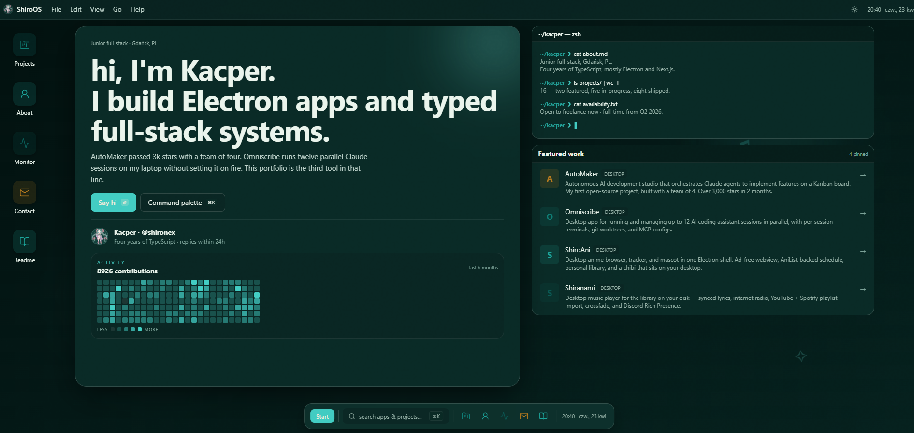

<a id="readme-top"></a>

[![Contributors][contributors-shield]][contributors-url]
[![Forks][forks-shield]][forks-url]
[![Stargazers][stars-shield]][stars-url]
[![Issues][issues-shield]][issues-url]
[![MIT License][license-shield]][license-url]

<!-- PROJECT LOGO -->
<br />
<div align="center">
  <a href="https://shirone.dev/">
    
  </a>

  <h3 align="center">My Portfolio</h3>

  <p align="center">
    A showcase of my development skills, projects, and contributions in full-stack development.
    <br />
    <a href="https://shirone.dev/"><strong>Demo Live »</strong></a>
  </p>
</div>

<!-- TABLE OF CONTENTS -->
<details>
  <summary>Table of Contents</summary>
  <ol>
    <li>
      <a href="#about-the-project">About The Project</a>
      <ul>
        <li><a href="#built-with">Built With</a></li>
      </ul>
    </li>
    <li>
      <a href="#getting-started">Getting Started</a>
      <ul>
        <li><a href="#prerequisites">Prerequisites</a></li>
        <li><a href="#installation">Installation</a></li>
      </ul>
    </li>
    <li><a href="#usage">Usage</a></li>
    <li><a href="#testing">Testing</a></li>
    <li><a href="#roadmap">Roadmap</a></li>
    <li><a href="#license">License</a></li>
  </ol>
</details>

<!-- ABOUT THE PROJECT -->

## About The Project

[](https://shirone.dev/)

This portfolio showcases my skills as a full-stack developer, focusing on modern technologies such as Next.js, TypeScript, TailwindCSS, and Framer Motion.

### Key Highlights:

- Clean and maintainable code.
- TailwindCSS for styling.
- motion react for animation.
- Cloudflare Turnstile for secure, bot-free interactions.
- Rate limiting with Redis.
- Contact form with Resend.
- Form validation with Zod and react-hook-form.
- MDX for blog posts.
- Send Discord notification with image snapshot using bullmq and puppeteer
- Comprehensive testing with Vitest and Playwright

Feel free to explore the code, suggest changes, or get in touch for any questions!

<p align="right">(<a href="#readme-top">back to top</a>)</p>

### Built With

This portfolio is built with a selection of modern tools and libraries f:

- Next js 15
- TailwindCSS
- motion react
- Cloudflare Turnstile
- Redis
- Resend
- Shadcn ui
- React-hook-form
- Zod
- Next safe action
- Docker-compose
- Bullmq
- puppeteer
- axios
- Vitest
- Playwright
- Testing Library

<p align="right">(<a href="#readme-top">back to top</a>)</p>

<!-- GETTING STARTED -->

## Getting Started

### Prerequisites

To use this project, you need to have pnpm installed.

- pnpm
  ```sh
  npm install -g pnpm
  ```

### Installation

1. Clone the repo
   ```sh
   git clone https://github.com/Shironex/portfolio.git
   ```
2. Install NPM packages
   ```sh
   pnpm install
   ```
3. Run docker-compose to start Redis instance
   ```sh
   docker-compose up -d
   ```
4. Create a `.env` file based on the `.env.example` file

5. Start the development server
   ```sh
   pnpm run dev
   ```

<p align="right">(<a href="#readme-top">back to top</a>)</p>

<!-- TESTING -->

## Testing

This project includes comprehensive testing using **Vitest** for unit and integration tests, and **Playwright** for end-to-end tests.

### Test Structure

```
tests/
├── unit/              # Unit tests for utilities and validation
├── integration/       # Integration tests for server actions and services
├── component/         # Component tests for React components
├── e2e/              # End-to-end tests with Playwright
├── fixtures/         # Test data fixtures
├── mocks/            # Mock implementations for external services
└── setup/            # Test utilities and helpers
```

### Running Tests

```sh
# Run all unit and integration tests
pnpm test

# Run tests in watch mode
pnpm test

# Run only unit tests
pnpm test:unit

# Run only integration tests
pnpm test:integration

# Run only component tests
pnpm test:component

# Run tests with coverage report
pnpm test:coverage

# Run tests with UI interface
pnpm test:ui

# Run E2E tests with Playwright
pnpm test:e2e

# Run E2E tests with Playwright UI
pnpm test:e2e:ui
```

### Test Coverage

The test suite covers:

- ✅ **Unit Tests**: Utilities (Cloudflare Turnstile, rate limiting), validation schemas, error classes
- ✅ **Integration Tests**: Mail service, Discord webhook, server actions
- ✅ **Component Tests**: UI components (Button, Input, Form, etc.)
- ✅ **E2E Tests**: Contact form flow, navigation, critical user journeys

### Writing Tests

#### Unit Test Example

```typescript
import { describe, expect, it } from 'vitest'

import { verifyTurnstile } from '@/lib/utils/cloudflare'

describe('verifyTurnstile', () => {
  it('should verify valid token', async () => {
    // Your test implementation
  })
})
```

#### Component Test Example

```typescript
import { Button } from '@/components/ui/button'
import { render, screen } from '@tests/setup/test-utils'
import { describe, expect, it } from 'vitest'

describe('Button', () => {
  it('should render button', () => {
    render(<Button>Click me</Button>)
    expect(screen.getByRole('button')).toBeInTheDocument()
  })
})
```

#### E2E Test Example

```typescript
import { expect, test } from '@playwright/test'

test('should navigate to about page', async ({ page }) => {
  await page.goto('/')
  await page.getByRole('link', { name: /about/i }).click()
  await expect(page).toHaveURL('/about')
})
```

### Mocking External Services

All external services are mocked in tests:

- **Redis**: In-memory mock using `ioredis-mock`
- **Resend**: Mocked email API responses
- **Discord**: Mocked webhook calls
- **Cloudflare Turnstile**: Mocked verification endpoint
- **Sentry**: Mocked error tracking

<p align="right">(<a href="#readme-top">back to top</a>)</p>

<!-- ROADMAP -->

## Roadmap

<p align="right">(<a href="#readme-top">back to top</a>)</p>

<!-- LICENSE -->

## License

Distributed under the MIT License. See `LICENSE.txt` for more information.

<p align="right">(<a href="#readme-top">back to top</a>)</p>

<!-- MARKDOWN LINKS & IMAGES -->
<!-- https://www.markdownguide.org/basic-syntax/#reference-style-links -->

[contributors-shield]: https://img.shields.io/github/contributors/othneildrew/Best-README-Template.svg?style=for-the-badge
[contributors-url]: https://github.com/shironex/portfolio/graphs/contributors
[forks-shield]: https://img.shields.io/github/forks/shironex/portfolio.svg?style=for-the-badge
[forks-url]: https://github.com/shironex/portfolio/network/members
[stars-shield]: https://img.shields.io/github/stars/shironex/portfolio.svg?style=for-the-badge
[stars-url]: https://github.com/shironex/portfolio/stargazers
[issues-shield]: https://img.shields.io/github/issues/shironex/portfolio.svg?style=for-the-badge
[issues-url]: https://github.com/shironex/portfolio/issues
[license-shield]: https://img.shields.io/github/license/shironex/portfolio.svg?style=for-the-badge
[license-url]: https://github.com/shironex/portfolio/blob/master/LICENSE.txt
