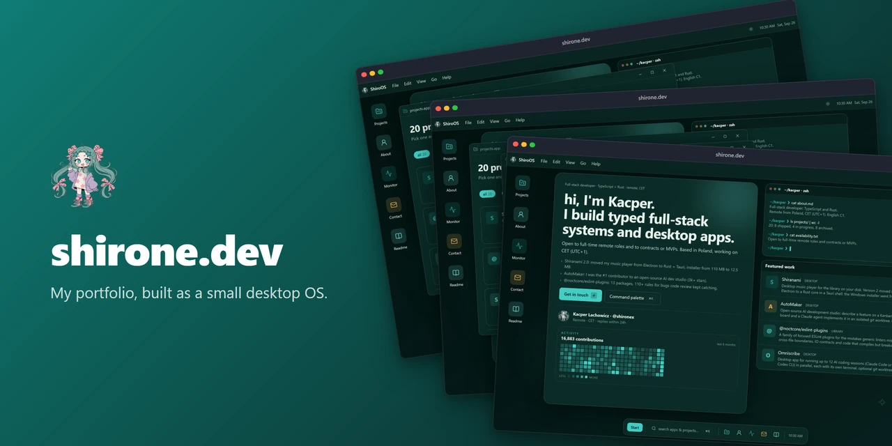
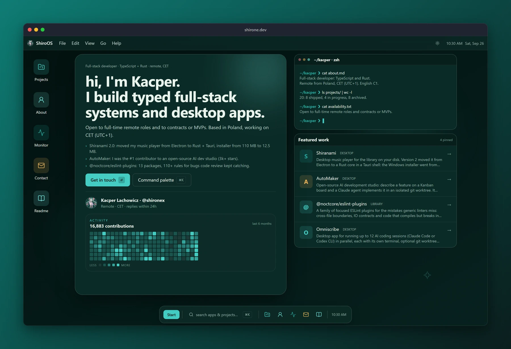
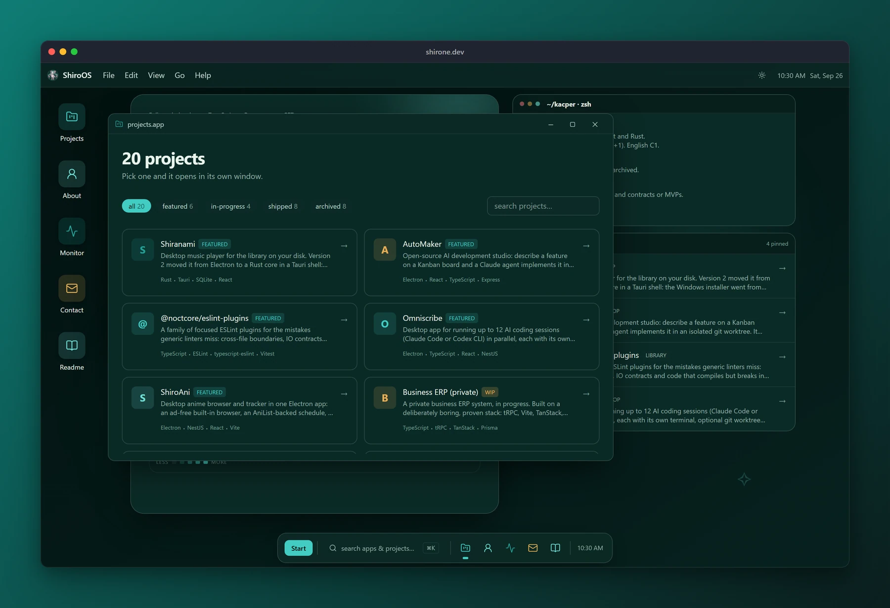
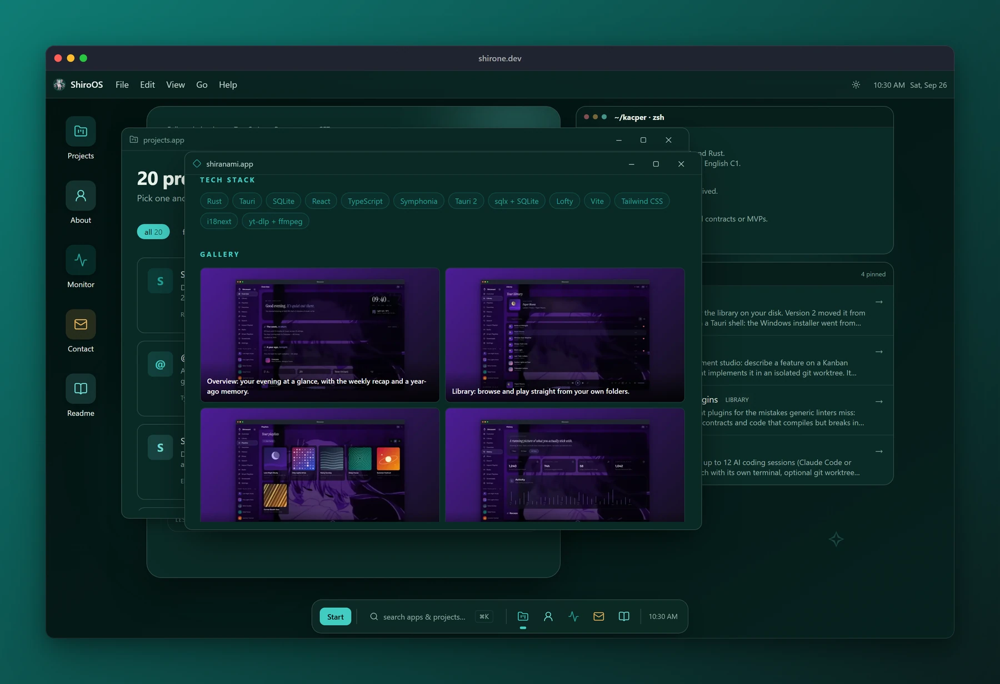
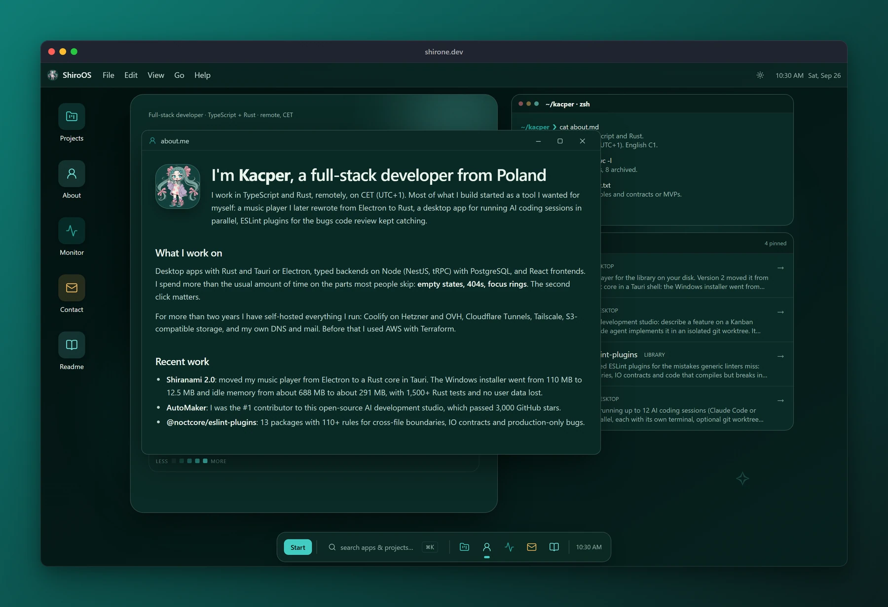
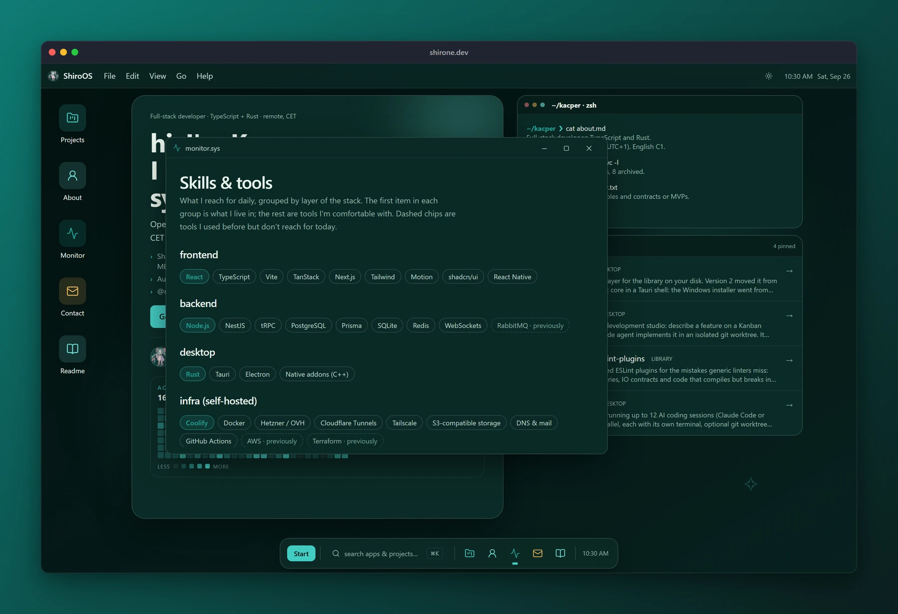
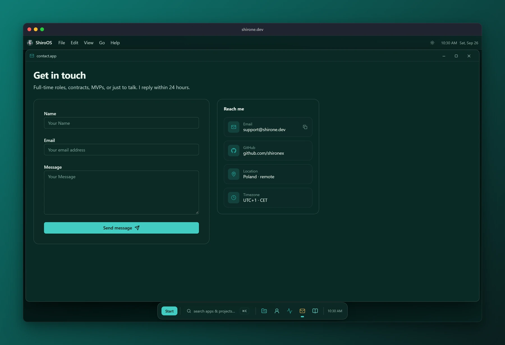
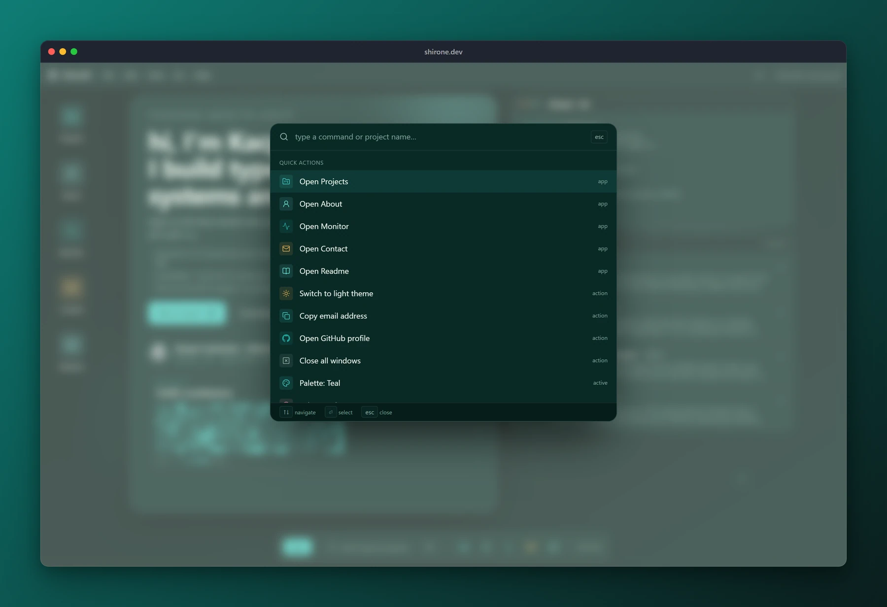
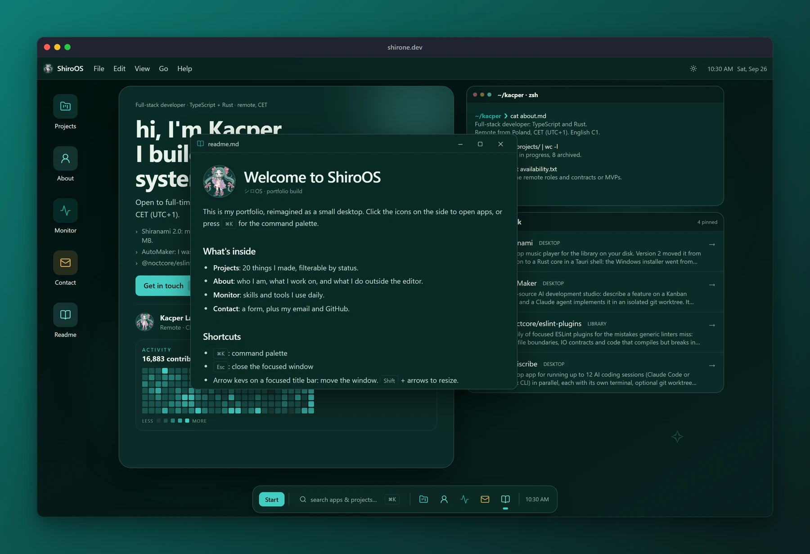

<div align="center">
  

  <h1>shirone.dev</h1>

  <p><strong>My portfolio, built as a small desktop OS in the browser.</strong></p>

  <p>
    <a href="https://github.com/Shironex/portfolio/releases/latest">
      
    </a>
    <a href="https://github.com/Shironex/portfolio/actions/workflows/build.yaml">
      
    </a>
    <a href="LICENSE.txt">
      
    </a>
  </p>

  <p>
    <a href="https://shirone.dev"><strong>Live site</strong></a>
    &nbsp;·&nbsp;
    <a href="CHANGELOG.md"><strong>Changelog</strong></a>
  </p>

  <blockquote>
    <p>Windows, a dock, a command palette and a terminal that tells you who I am. Click around, or press Ctrl+K.</p>
  </blockquote>
</div>

---

### What is this?

This is my portfolio. Instead of a long scrolling page, it opens as a desktop: my projects, a short about page, the tools I use and a contact form each live in their own window, and everything can be reached from the command palette. On a phone it turns into a simple feed with a dock.

### Screenshots

<table>
  <tr>
    <td width="50%"></td>
    <td width="50%"></td>
  </tr>
  <tr>
    <td align="center"><sub>The desktop: who I am, a short shell transcript, featured projects and my GitHub activity.</sub></td>
    <td align="center"><sub>Projects: everything I have built, filterable by status.</sub></td>
  </tr>
  <tr>
    <td width="50%"></td>
    <td width="50%"></td>
  </tr>
  <tr>
    <td align="center"><sub>A project window, scrolled to its tech stack and screenshot gallery.</sub></td>
    <td align="center"><sub>About: who I am, what I work on and what I do away from code.</sub></td>
  </tr>
  <tr>
    <td width="50%"></td>
    <td width="50%"></td>
  </tr>
  <tr>
    <td align="center"><sub>Monitor: the languages, frameworks and tools I use every day.</sub></td>
    <td align="center"><sub>Contact: a form, plus my email and GitHub.</sub></td>
  </tr>
  <tr>
    <td width="50%"></td>
    <td width="50%"></td>
  </tr>
  <tr>
    <td align="center"><sub>The command palette: open any app or project, switch the theme or the palette.</sub></td>
    <td align="center"><sub>Readme: a short welcome note and the keyboard shortcuts.</sub></td>
  </tr>
</table>

### What's inside

|                      |                                                                                                                 |
| -------------------- | --------------------------------------------------------------------------------------------------------------- |
| **Desktop shell**    | Menu bar, desktop icons, windows you can drag, resize, minimize and maximize, a taskbar and a start menu        |
| **Command palette**  | Ctrl+K (Cmd+K on macOS) opens any app or project, switches the theme and the palette, and copies my email       |
| **Keyboard windows** | On a focused title bar: arrow keys move the window, Shift+arrows resize it, Ctrl+W closes, Ctrl+M minimizes     |
| **Themes**           | Light and dark mode and six colour palettes, applied before the first paint so there is no flash                |
| **Mobile layout**    | Below 768px the desktop becomes a vertical feed with a bottom dock, and windows open as full-screen sheets      |
| **Projects**         | Every project is a typed data file, filterable by status and searchable, with its own window and a gallery      |
| **GitHub activity**  | A contribution heatmap from GitHub's GraphQL API, cached for six hours; it turns on when `GITHUB_TOKEN` is set  |
| **Contact form**     | next-safe-action and Zod, Cloudflare Turnstile, a honeypot, a Redis rate limit, Resend email and a Discord ping |
| **Boot splash**      | A short greeting once per tab, skippable, and skipped entirely when you prefer reduced motion                   |
| **Fast first paint** | The hero text is server-rendered under the client shell, with a plain HTML fallback when JavaScript is off      |
| **Security headers** | A Content Security Policy and the usual hardening headers, set in `src/proxy.ts`                                |
| **Social images**    | Open Graph and Twitter images rendered by the app itself                                                        |
| **Analytics**        | PostHog, loaded only once the browser is idle or you interact with the page                                     |
| **End to end tests** | Playwright specs for the responsive layout and the theme toggle                                                 |

### Built with

|           |                                                                                |
| --------- | ------------------------------------------------------------------------------ |
| Framework | Next.js 16 (App Router, Turbopack, Cache Components), React 19                 |
| Language  | TypeScript 6                                                                   |
| Styling   | Tailwind CSS 4, Radix UI primitives, Lucide icons                              |
| Forms     | React Hook Form, Zod 4, next-safe-action                                       |
| Services  | Resend and React Email, Redis (ioredis), Cloudflare Turnstile, PostHog         |
| Quality   | ESLint 10 with my `@noctcore` plugins, Prettier, Playwright, Husky, commitlint |
| Releases  | semantic-release on GitHub Actions                                             |

### Getting started

You need [Node.js](https://nodejs.org/) 22.13 or newer and [pnpm](https://pnpm.io/) 10.9 or newer.

```bash
git clone https://github.com/Shironex/portfolio.git
cd portfolio
pnpm install
cp .env.example .env    # on Windows cmd: copy .env.example .env
pnpm dev
```

The placeholder values in `.env.example` are enough to run the site locally: the Turnstile keys are Cloudflare's
always-pass test keys, and Redis is only used for the contact form's rate limit, which is skipped in development. For a
local production build, `docker compose up -d` starts Redis. Uncomment `GITHUB_TOKEN` and set it (a fine-grained token with read-only access to public
repositories) to see the GitHub heatmap.

| Command          | What it does                                    |
| ---------------- | ----------------------------------------------- |
| `pnpm dev`       | Dev server with Turbopack on port 3000          |
| `pnpm dev:email` | React Email preview of the templates, port 3001 |
| `pnpm build`     | Production build                                |
| `pnpm start`     | Serve the production build                      |
| `pnpm lint`      | ESLint                                          |
| `pnpm typecheck` | TypeScript, no emit                             |
| `pnpm format`    | Prettier over `src/`                            |
| `pnpm test:e2e`  | Playwright end to end tests                     |

### Showcase images

The images in this README and the project galleries are captured with
[`@noctcore/showcase-kit`](https://www.npmjs.com/package/@noctcore/showcase-kit):

- `pnpm showcase:portfolio` builds this site on mock values and captures `assets/showcase/`, hero included (stop
  `pnpm dev` first, it rebuilds `.next`).
- `pnpm showcase:blog` captures shirone.blog into `public/projects/shirone-blog/`.
- `pnpm showcase:eslint` captures the ESLint plugins docs into `public/projects/eslint-plugins/`.

### Releases

Every push to `master` runs [semantic-release](https://semantic-release.gitbook.io/): it reads the conventional
commits, bumps the version, updates [CHANGELOG.md](CHANGELOG.md) and publishes a
[GitHub release](https://github.com/Shironex/portfolio/releases).

### License

MIT, see [LICENSE.txt](LICENSE.txt).
