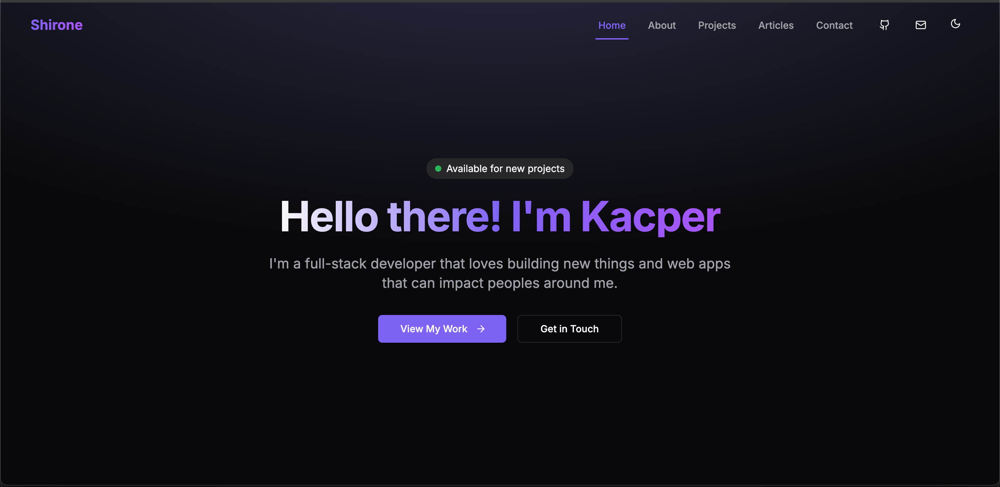

<a id="readme-top"></a>

[![Contributors][contributors-shield]][contributors-url]
[![Forks][forks-shield]][forks-url]
[![Stargazers][stars-shield]][stars-url]
[![Issues][issues-shield]][issues-url]
[![MIT License][license-shield]][license-url]

<!-- PROJECT LOGO -->
<br />
<div align="center">
  <a href="https://shirone.xyz/">
    
  </a>

  <h3 align="center">My Portfolio</h3>

  <p align="center">
    A showcase of my development skills, projects, and contributions in full-stack development.
    <br />
    <a href="https://shirone.xyz/"><strong>Demo Live »</strong></a>
  </p>
</div>

<!-- TABLE OF CONTENTS -->
<details>
  <summary>Table of Contents</summary>
  <ol>
    <li>
      <a href="#about-the-project">About The Project</a>
      <ul>
        <li><a href="#built-with">Built With</a></li>
      </ul>
    </li>
    <li>
      <a href="#getting-started">Getting Started</a>
      <ul>
        <li><a href="#prerequisites">Prerequisites</a></li>
        <li><a href="#installation">Installation</a></li>
      </ul>
    </li>
    <li><a href="#usage">Usage</a></li>
    <li><a href="#roadmap">Roadmap</a></li>
    <li><a href="#license">License</a></li>
  </ol>
</details>

<!-- ABOUT THE PROJECT -->

## About The Project

[](https://shirone.xyz/)

This portfolio showcases my skills as a full-stack developer, focusing on modern technologies such as Next.js, TypeScript, TailwindCSS, and Framer Motion.

### Key Highlights:

- Clean and maintainable code.
- TailwindCSS for styling.
- motion react for animation.
- Cloudflare Turnstile for secure, bot-free interactions.
- Rate limiting with Redis.
- Contact form with Resend.
- Form validation with Zod and react-hook-form.
- MDX for blog posts.
- Send Discord notification with image snapshot using bullmq and puppeteer

Feel free to explore the code, suggest changes, or get in touch for any questions!

<p align="right">(<a href="#readme-top">back to top</a>)</p>

### Built With

This portfolio is built with a selection of modern tools and libraries f:

- Next js 15
- TailwindCSS
- motion react
- Cloudflare Turnstile
- Redis
- Resend
- Shadcn ui
- React-hook-form
- Zod
- Next safe action
- Docker-compose
- Bullmq
- puppeteer
- axios

<p align="right">(<a href="#readme-top">back to top</a>)</p>

<!-- GETTING STARTED -->

## Getting Started

### Prerequisites

To use this project, you need to have pnpm installed.

- pnpm
  ```sh
  npm install -g pnpm
  ```

### Installation

1. Clone the repo
   ```sh
   git clone https://github.com/Shironex/portfolio.git
   ```
2. Install NPM packages
   ```sh
   pnpm install
   ```
3. Run docker-compose to start Redis instance
   ```sh
   docker-compose up -d
   ```
4. Create a `.env` file based on the `.env.example` file

5. Start the development server
   ```sh
   pnpm run dev
   ```

<p align="right">(<a href="#readme-top">back to top</a>)</p>

<!-- ROADMAP -->

## Roadmap

<p align="right">(<a href="#readme-top">back to top</a>)</p>

<!-- LICENSE -->

## License

Distributed under the MIT License. See `LICENSE.txt` for more information.

<p align="right">(<a href="#readme-top">back to top</a>)</p>

<!-- MARKDOWN LINKS & IMAGES -->
<!-- https://www.markdownguide.org/basic-syntax/#reference-style-links -->

[contributors-shield]: https://img.shields.io/github/contributors/othneildrew/Best-README-Template.svg?style=for-the-badge
[contributors-url]: https://github.com/shironex/portfolio/graphs/contributors
[forks-shield]: https://img.shields.io/github/forks/shironex/portfolio.svg?style=for-the-badge
[forks-url]: https://github.com/shironex/portfolio/network/members
[stars-shield]: https://img.shields.io/github/stars/shironex/portfolio.svg?style=for-the-badge
[stars-url]: https://github.com/shironex/portfolio/stargazers
[issues-shield]: https://img.shields.io/github/issues/shironex/portfolio.svg?style=for-the-badge
[issues-url]: https://github.com/shironex/portfolio/issues
[license-shield]: https://img.shields.io/github/license/shironex/portfolio.svg?style=for-the-badge
[license-url]: https://github.com/shironex/portfolio/blob/master/LICENSE.txt
